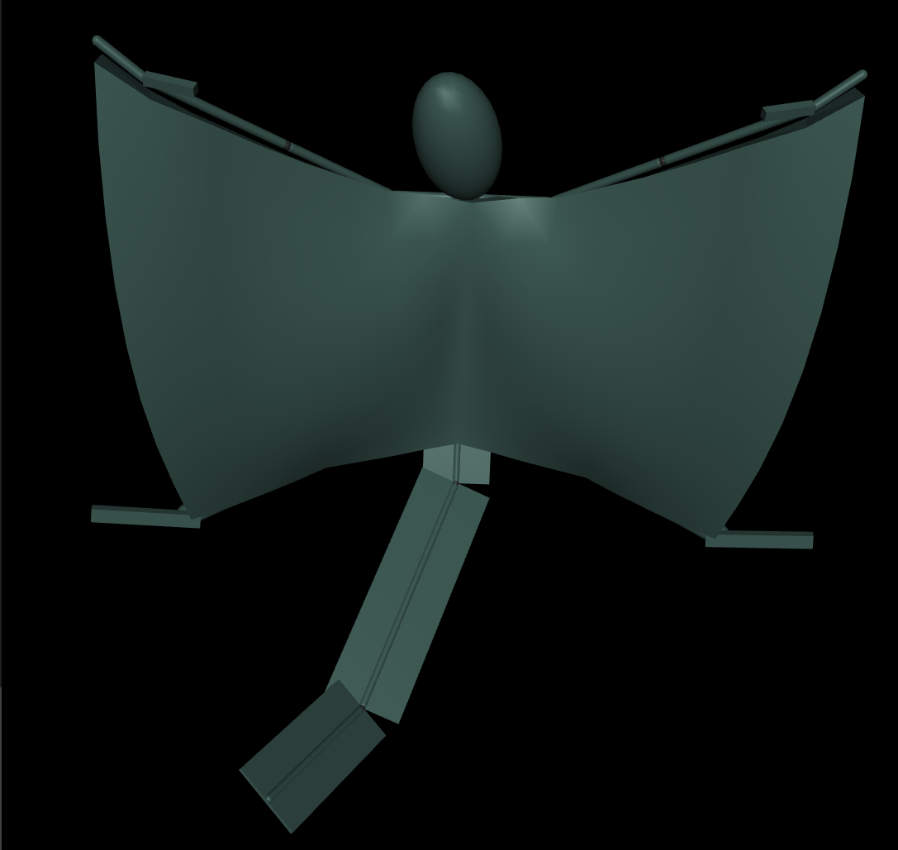
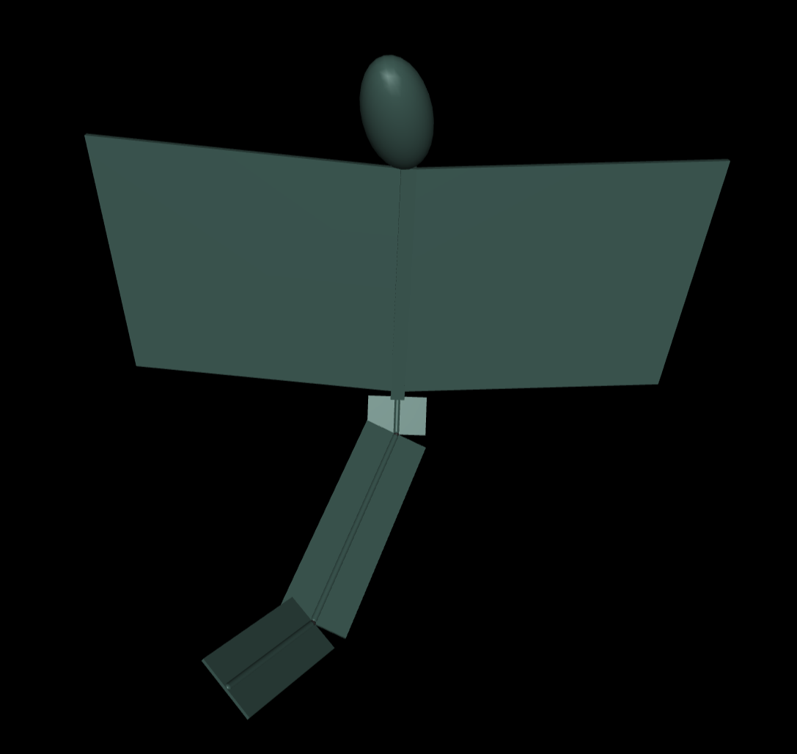

# 	In-silico modeling and flight optimization of a bio-inspired flying squirrel robot

The code for my Master's thesis at Ghent University (UGent), Belgium.

> **Note:**
> The main language for this thesis is Dutch, so that's why plots have Dutch labels.

*Figure 1: flexcomp model*

*Figure 2: simplified model*